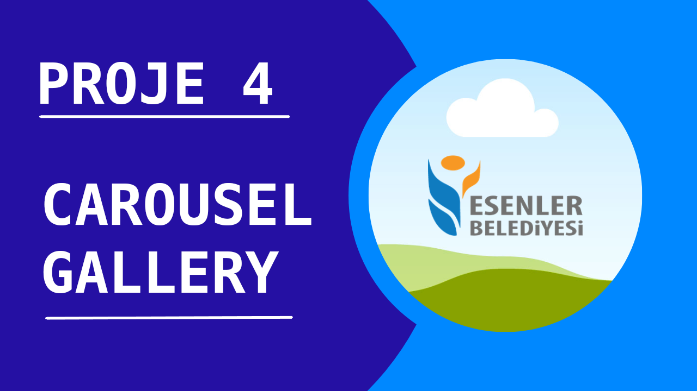

# English

### Project 4 - Carousel Gallery

 

This project aims to build a project as a assigned photo gallery homework from forth week. And I have decided to make carousel gallery from Bootstrap as gallery design by myself. Total of 10 photos are dynamically taken from source.unsplash.com in our carousel gallery. Icons are taken directly from site instead of API.
It changes the current picture according to the index number when it is collected on a array and switched to the previous or next or any picture on the carousel gallery. Icons are taken from Font Awesome.

Deployed at https://sahinmaral-carouselgallery.netlify.app

<b>Click to picture to watch for understanding how to build </b>

<a href="https://www.youtube.com/watch?v=UJMc-P8kiZg">
</img>
</a>

 
 
 

# Türkçe

### Proje 4 - Carousel Gallery

 

Bu projedeki amaç , dördüncü haftada verilen fotoğraf galerisi ödevine göre daha özgün bir proje yapabilmektir. Ben de galeri tasarımı olarak Bootstrap üzerinde yer alan carousel tasarımı kendim yapmaya karar verdim. Carousel galerimizde toplam 10 tane fotoğraf dinamik olarak source.unsplash.com üzerinden alınmaktadır. Resimler API üzerinden değil de direkt site üzerinden alınmaktadır. Bir dizi üzerinde toplanıp carousel galeri üzerinde bir önceki veya sonraki veya herhangi bir resme geçiş yapıldığında index numarasına göre şu anki resmi değiştirmektedir. Icon lar Font Awesome üzerinden alınmaktadır.

https://sahinmaral-carouselgallery.netlify.app sitesine deploy edilmiştir

<b> Nasıl yapıldığını anlamak için resme tıklayıp izleyebilirsiniz </b>

<a href="https://www.youtube.com/watch?v=UJMc-P8kiZg">
</img>
</a>