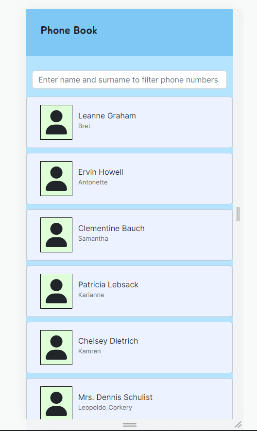

# English

### Project 6 - Phone Book

The purpose of this project is one of the assignments given in the sixth week to learn what the componentDidMount function does on React and to learn fetch operations via API. In our assignment, it was requested to list the data by taking data through an API determined. But in order to make an original project, I wanted to make an application like a phone book. In our project,we have used axios for fetch operations, Font Awesome as icon package, reactstrap as CSS framework, but my advice is to learn Tailwind CSS in the future. Because, during the video, you will realize that it is not so easy to generate class names for some HTML elements. Tailwind CSS solves this and more. The smaller the page width of the application, the more information needs to be hidden so that it does not overflow on the screen. I used Modal on reactstrap to display this information. When users are clicked, a Modal with the user's details will appear. In the fifth week, we made our application based on functional component, but since the people who will watch this video will generally be students who attend the training, I will continue to write it as a class component if the functional component is not processed in the training. I added a component called Form to filter by users' names and surnames. But since it was a comprehensive project, I had to split it into two videos, and like the other videos, we did it from scratch from start to finish. In the videos, I also shared some fundamental information on React, especially because I discovered that some students in education did not know this fundamental informations.

This project is deployed at https://sahinmaral-phonebook.netlify.app

<b>Click to pictures to watch for understanding how to build </b>

<a href="https://www.youtube.com/watch?v=ZogkNfnmMGE">
</img>
</a>

<a href="https://www.youtube.com/watch?v=z9Rcita6g5g">
</img>
</a>

## Preview at laptop display
</img>

## Preview at mobile display
</img>

## Preview of modal component
</img>

 
 
 

# Türkçe

### Proje 6 - Phone Book

Bu projemizdeki amaç , altıncı haftada React üzerinde componentDidMount fonksiyonunun ne işe yaradığını öğrenmek ve API üzerinden fetch işlemlerini öğrenmek amacıyla verilen ödevlerden biridir. Ödevimizde belirlenmiş bir API üzerinden veriler alınarak bunların listelenmesi istenmiştir. Fakat özgün bir proje yapmak adına ben telefon defteri gibi bir uygulama yapmak istedim. Projemizde fetch işlemleri için axios , icon paketi olarak Font Awesome , CSS framework olarak reactstrap kullanılmıştır fakat tavsiyem ileriki zamanlarda Tailwind CSS öğrenmenizdir. Çünkü video sırasında çoğu kez de farkına varacaksaksınız ki bazı HTML element lerine class adı üretmek o kadar da kolay değil. Tailwind CSS , bu ve daha fazla sorunu çözmüş oluyor. Uygulamanın sayfa genişliği ne kadar küçülürse ekranda taşmaması için bazı bilgilerin gizlenmesi gerekir. Bu bilgileri görüntüleyebilmek için reactstrap üzerinde yer alan Modal kullandım. Kullanıcılara tıklandığında kullanıcının detaylarının yer aldığı bir Modal gözükecektir. Beşinci haftada uygulamamızı functional component esaslı yapmıştık fakat bu videoyu izleyecek olan insanlar , genelde eğitime katılan öğrenciler olacağı için eğitimde functional component işlenmediği taktirde class component olarak yazmaya devam edeceğim. Kullanıcıların isim ve soyisimlerine göre filtreleme yapmak için Form adlı bir component ekledim. Fakat kapsamlı bir proje olduğu için iki videoya bölmek zorunda kaldım ve diğer videolardaki gibi baştan sona kadar sıfırdan beraber yapmış olduk. Videoların içerisinde React üzerinde bazı hap bilgiler de paylaşmış oldum , özellikle bu hap bilgilerin eğitimdeki bazı öğrencilerin bilmediğini keşfettiğim için paylaştım.

https://sahinmaral-phonebook.netlify.app sitesine deploy edilmiştir.

<b> Nasıl yapıldığını anlamak için resimlere tıklayip izleyebilirsiniz </b>

<a href="https://www.youtube.com/watch?v=ZogkNfnmMGE">
</img>
</a>

<a href="https://www.youtube.com/watch?v=z9Rcita6g5g">
</img>
</a>

## Laptop ekranında görünümü
</img>

## Telefon ekranında görünümü
</img>

## Modal component görünümü
</img>

# Getting Started with Create React App

This project was bootstrapped with [Create React App](https://github.com/facebook/create-react-app).

## Available Scripts

In the project directory, you can run:

### `npm start`

Runs the app in the development mode.\
Open [http://localhost:3000](http://localhost:3000) to view it in your browser.

The page will reload when you make changes.\
You may also see any lint errors in the console.

### `npm test`

Launches the test runner in the interactive watch mode.\
See the section about [running tests](https://facebook.github.io/create-react-app/docs/running-tests) for more information.

### `npm run build`

Builds the app for production to the `build` folder.\
It correctly bundles React in production mode and optimizes the build for the best performance.

The build is minified and the filenames include the hashes.\
Your app is ready to be deployed!

See the section about [deployment](https://facebook.github.io/create-react-app/docs/deployment) for more information.

### `npm run eject`

**Note: this is a one-way operation. Once you `eject`, you can't go back!**

If you aren't satisfied with the build tool and configuration choices, you can `eject` at any time. This command will remove the single build dependency from your project.

Instead, it will copy all the configuration files and the transitive dependencies (webpack, Babel, ESLint, etc) right into your project so you have full control over them. All of the commands except `eject` will still work, but they will point to the copied scripts so you can tweak them. At this point you're on your own.

You don't have to ever use `eject`. The curated feature set is suitable for small and middle deployments, and you shouldn't feel obligated to use this feature. However we understand that this tool wouldn't be useful if you couldn't customize it when you are ready for it.

## Learn More

You can learn more in the [Create React App documentation](https://facebook.github.io/create-react-app/docs/getting-started).

To learn React, check out the [React documentation](https://reactjs.org/).

### Code Splitting

This section has moved here: [https://facebook.github.io/create-react-app/docs/code-splitting](https://facebook.github.io/create-react-app/docs/code-splitting)

### Analyzing the Bundle Size

This section has moved here: [https://facebook.github.io/create-react-app/docs/analyzing-the-bundle-size](https://facebook.github.io/create-react-app/docs/analyzing-the-bundle-size)

### Making a Progressive Web App

This section has moved here: [https://facebook.github.io/create-react-app/docs/making-a-progressive-web-app](https://facebook.github.io/create-react-app/docs/making-a-progressive-web-app)

### Advanced Configuration

This section has moved here: [https://facebook.github.io/create-react-app/docs/advanced-configuration](https://facebook.github.io/create-react-app/docs/advanced-configuration)

### Deployment

This section has moved here: [https://facebook.github.io/create-react-app/docs/deployment](https://facebook.github.io/create-react-app/docs/deployment)

### `npm run build` fails to minify

This section has moved here: [https://facebook.github.io/create-react-app/docs/troubleshooting#npm-run-build-fails-to-minify](https://facebook.github.io/create-react-app/docs/troubleshooting#npm-run-build-fails-to-minify)
