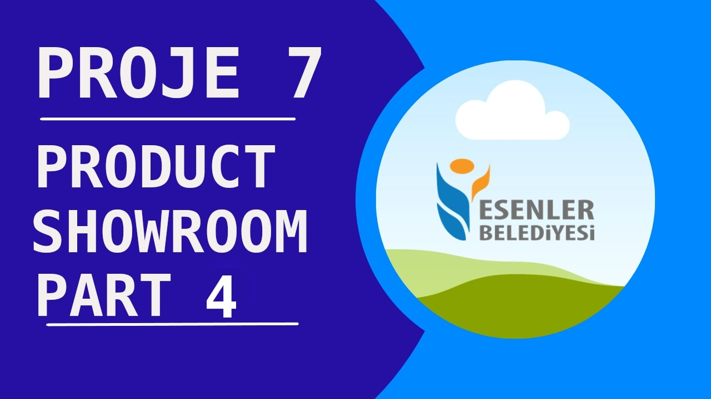

# Başlıklar / Headings

- [Türkçe Dökümantasyon](#tr-doc)
  - [Kullanılan Teknolojiler](#tr-used-tech)
  - [Yapılan Aşamalar](#tr-processes)
  - [Ön İzleme](#tr-preview)
- [English Documentation](#eng-doc)
  - [Technologies has been used](#eng-used-tech)
  - [Steps has been made](#eng-processes)
  - [Preview](#eng-preview)
- [React configuration](#react-conf)

## 
TR - Product Showroom App

### 
Kullanılan teknolojiler

- Axios
- Redux
- Redux-Toolkit
- React Router
- Ant Design

### 
Yapılan aşamalar

- Projeye başlanmadan önce paketlerin kurulumu yapıldı.

- State management olarak Redux kullanıldı. Redux üzerinde daha performanslı ve efektif kod yazabilmek için Redux Toolkit kullanıldı.

- Başlangıçta CSS framework olarak Material UI yerine ileriki zamanlarda Ant Design kullanıldı.

- React üzerindeki yer alan useState ve useEffect hook ları anlatıldı.

- Sayfalar belirlendi (ProductList , Profile , ProductDetail gibi sayfalar)

- Sayfalar üzerindeki component lar belirlendi (Header, ProductCard , NameFilter , CategoryFilter gibi component lar)

- Ürünler üzerinde proje üzerinde bir back-end uygulamayla bağlantılı olmadığımız için client-side üzerinde kaydetmek koşuluyla (localStorage) favorilere ekleme - çıkarma işlemleri yapıldı.

- Ürünler üzerinde kategori ve isme göre filtreleme yapıldı.

- Uygulama , çoğu cihazlar için responsive tasarıma sahip olacak şekilde tasarlandı.

### 
Ön izleme

Bu projemizde amaç , yedinci haftada React üzerinde öğretilen projelerimiz kompleks leştiği sürece state management zorlaşacağı için bu yönetimleri prop-drilling gibi kavramlarla halletmek yerine genel bilinen state management lardan biri olan Redux ile bir proje oluşturmaktır. Projemizdeki amaç , Fake Store API üzerinden alınan sahte ürün verilerini listelemek , bu verilere herhangi bir component üzerinden ulaşabilmek , filtrelebilmek ve manipülasyonlar yapabilmektir.
Birinci videoda proje üzerinde kullanmamız gereken paketlerimizi indirdik. Redux , güncel versiyon olarak kullanıldı. Daha efektif ve performanslı bir kod yazabilmek için Redux Toolkit kullandık ve useSelector , useDispatch gibi hook ları anlattım.
İkinci videoda API üzerinden aldığımız verileri listelemek , component larımızın tasarımı ve sayfalama işlemlerinin React üzerinde nasıl sağlandığını anlattım. Üçüncü videoda ürünler üzerinde favori ekleme seçeneği ekleyip bunun için ortam oluşturduk ve favori ürünlerimizi herhangi bir back-end uygulaması ile iletişime geçemediğimiz için client-side üzerinde geçici olarak kaydettik. Redux Toolkit in kullanımlarından biri ise Redux üzerinde state lerimizde array , object gibi değişkenlerde tamamıyla bir değişiklik yerine herhangi bir öğesini değiştirmeniz halinde (array lerde push , pop işlemleri veya object üzerinde değiştirmiş olduğunuz property) bu gibi değişkenleri spread operatör ile bütün öğelerini alıp yeni bir değişken olarak atamamız gerekir.
[Objelerde](#objelerde-usereducer-kullanımı) ve [dizilerde](#dizilerde-usereducer-kullanımı) nasıl yapılması gerektiğini linklere tıklayarak inceleyebilirsiniz. Uygulamamızın son videosu olan dördüncü videosunda useCallback ve useMemo hook unun önemini , ürünlerimiz üzerinde filtreleme sistemini ve uygulama üzerinde Ant Design içerisinde yer alan component ların kullanımını anlatmış oldum. Benim için uzun ve eğlenceli bir video serisi oldu. İleriki zamanlarda bunun gibi bir uygulama yaparken önceden yol haritamızı belirleyerek bir video seriyi yapmayı planlarsam video sürelerini tabii ki de kısaltabilirim. Videoları izleyebilmek için Youtube thumbnail resimlerine tıklayıp Youtube videolarına gidebilirsiniz. Eğer videoları beğendiyseniz kanala abone olmayı ve beğen tuşuna basmayı unutmayın.

https://sahinmaral-productshowroom.netlify.app sitesine deploy edilmiştir.

#### Objelerde useReducer kullanımı

    function reducer(state, action) {
    switch (action.type) {
        case 'incremented_age': {
        // 🚩 State içerisindeki objelerinizde property lerini değiştirirken bu yöntemden kaçının
        state.age = state.age + 1;
        return state;
        }

    function reducer(state, action) {
    switch (action.type) {
        case 'incremented_age': {
        // ✅ Bunun yerine spread operatörü ile yeniden objenizi oluşturun. Bu sayede objenizin bellekteki referans numarası değişecektir ve React bu state değişimini algılayacaktır.
        return {
            ...state,
            age: state.age + 1
        };
        }

#### Dizilerde useReducer kullanımı

    function tasksReducer(tasks, action) {
        switch (action.type)    {
                case 'added': {
                // 🚩 Dizinin içerisine değişken ekleme veya çıkartma işlemlerinde dizinin tamamıyla bellekteki yeri değişmediği için referans numarası da değişmiyor.
                tasks.push({
                    id: action.id,
                    text: action.text,
                    done: false
                })
                return state
            }
        }
    }

    function tasksReducer(tasks, action) {
        switch (action.type)    {
                case 'added': {
                // ✅ Bunun yerine yine spread operatörü ile diziyi parçalayarak bütün değerlerini yeni bir dizi içerisine eklenecek olan objeyle birlikte ekliyoruz.
                return [...tasks, {
                    id: action.id,
                    text: action.text,
                    done: false
                }];
            }
        }
    }

 
 
 
 
 
 
 
 
 
 
 

## 
ENG - Product Showroom App

### 
Technologies has been used

- Axios
- Redux
- Redux-Toolkit
- React Router
- Ant Design

### 
Steps has been made

- Packages were installed before starting the project.

- Redux is used as state management. Redux Toolkit was used to write more efficient and effective code on Redux.

- Initially, Ant Design was used as the CSS framework instead of Material UI.

- The useState and useEffect hooks on React are explained.

- Pages determined (Pages such as ProductList , Profile , ProductDetail)

- Components on the pages were determined (components such as Header, ProductCard, NameFilter, CategoryFilter)

- Since we are not connected to a back-end application on the project, adding and removing the products to favorites, provided that they are saved on the client-side (localStorage).

- Filtered products by category and name.

- The application is designed to have a responsive design for most devices.

### 
Preview

In this project, the aim is to create a project with Redux, one of the generally known state managements, instead of dealing with concepts such as prop-drilling, as state management will become more difficult as our projects taught on React in the seventh week become complex. The purpose of our project is to list the fake product data received through the Fake Store API, to access this data through any component, to be able to filter and to perform manipulations.
In the first video, we downloaded our packages that we need to use on the project. Redux was used as the current version. We used Redux Toolkit to write more effective and performance code and I explained hooks such as useSelector , useDispatch.
In the second video, I explained how to list the data we received through the API, the design of our components and how the pagination processes are provided on React. In the third video, we added the option to add favorites on the products and created an environment for this, and we temporarily saved our favorite products on the client-side as we could not communicate with any back-end application. One of the uses of the Redux Toolkit is if you change any of its elements (push, pop operations in arrays or the property you have changed on the object) instead of a complete change in variables such as array , object in our states on Redux, we take all the elements of such variables with the spread operator and create a new variable. We should assign as
You can check out how should objects and arrays used at useReducer hooks by clicking [objects](#using-useReducer-on-objects) and [arrays](#using-useReducer-on-arrays) In the fourth video, which is the last video of our application, I explained the importance of useCallback and useMemo hooks, the filtering system on our products, and the use of components in Ant Design on the application. It's been a long and fun video series for me. If I plan to make a video series by determining our roadmap beforehand while making an application like this in the future, I can of course shorten the video durations. To watch the videos, you can click on the Youtube thumbnail images and go to the Youtube videos. If you like the videos, don't forget to subscribe to the channel and hit the like button.

It has been deployed to https://sahinmaral-productshowroom.netlify.app.

#### Using useReducer on objects

    function reducer(state, action) {
    switch (action.type) {
        case 'incremented_age': {
        // 🚩 Avoid this method when changing properties on your objects in State
        state.age = state.age + 1;
        return state;
        }

    function reducer(state, action) {
    switch (action.type) {
        case 'incremented_age': {
        // ✅ Instead, recreate your object with the spread operator. In this way, your object's reference number in memory will change and React will detect this state change.
        return {
            ...state,
            age: state.age + 1
        };
        }

#### Using useReducer on arrays

    function tasksReducer(tasks, action) {
        switch (action.type)    {
                case 'added': {
                // 🚩 The reference number does not change, as the entire location of the array in memory does not change during the process of adding or removing variables into the array.
                tasks.push({
                    id: action.id,
                    text: action.text,
                    done: false
                })
                return state
            }
        }
    }

    function tasksReducer(tasks, action) {
        switch (action.type)    {
                case 'added': {
                // ✅ Instead, we split the array with the spread operator and add all its values ​​together with the object to be added into a new array.
                return [...tasks, {
                    id: action.id,
                    text: action.text,
                    done: false
                }];
            }
        }
    }

 
 
 
 
 
 
 
 
 
 
 

## 
Getting Started with Create React App 

This project was bootstrapped with [Create React App](https://github.com/facebook/create-react-app).

### Available Scripts

In the project directory, you can run:

#### `npm start`

Runs the app in the development mode.\
Open [http://localhost:3000](http://localhost:3000) to view it in your browser.

The page will reload when you make changes.\
You may also see any lint errors in the console.

#### `npm test`

Launches the test runner in the interactive watch mode.\
See the section about [running tests](https://facebook.github.io/create-react-app/docs/running-tests) for more information.

#### `npm run build`

Builds the app for production to the `build` folder.\
It correctly bundles React in production mode and optimizes the build for the best performance.

The build is minified and the filenames include the hashes.\
Your app is ready to be deployed!

See the section about [deployment](https://facebook.github.io/create-react-app/docs/deployment) for more information.

#### `npm run eject`

**Note: this is a one-way operation. Once you `eject`, you can't go back!**

If you aren't satisfied with the build tool and configuration choices, you can `eject` at any time. This command will remove the single build dependency from your project.

Instead, it will copy all the configuration files and the transitive dependencies (webpack, Babel, ESLint, etc) right into your project so you have full control over them. All of the commands except `eject` will still work, but they will point to the copied scripts so you can tweak them. At this point you're on your own.

You don't have to ever use `eject`. The curated feature set is suitable for small and middle deployments, and you shouldn't feel obligated to use this feature. However we understand that this tool wouldn't be useful if you couldn't customize it when you are ready for it.

### Learn More

You can learn more in the [Create React App documentation](https://facebook.github.io/create-react-app/docs/getting-started).

To learn React, check out the [React documentation](https://reactjs.org/).

#### Code Splitting

This section has moved here: [https://facebook.github.io/create-react-app/docs/code-splitting](https://facebook.github.io/create-react-app/docs/code-splitting)

#### Analyzing the Bundle Size

This section has moved here: [https://facebook.github.io/create-react-app/docs/analyzing-the-bundle-size](https://facebook.github.io/create-react-app/docs/analyzing-the-bundle-size)

#### Making a Progressive Web App

This section has moved here: [https://facebook.github.io/create-react-app/docs/making-a-progressive-web-app](https://facebook.github.io/create-react-app/docs/making-a-progressive-web-app)

#### Advanced Configuration

This section has moved here: [https://facebook.github.io/create-react-app/docs/advanced-configuration](https://facebook.github.io/create-react-app/docs/advanced-configuration)

#### Deployment

This section has moved here: [https://facebook.github.io/create-react-app/docs/deployment](https://facebook.github.io/create-react-app/docs/deployment)

#### `npm run build` fails to minify

This section has moved here: [https://facebook.github.io/create-react-app/docs/troubleshooting#npm-run-build-fails-to-minify](https://facebook.github.io/create-react-app/docs/troubleshooting#npm-run-build-fails-to-minify)
