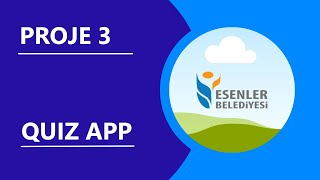

# English

### Project 3 - Quiz App

 

This project aims to build a quiz app that every questions come from a JSON file. Due to the learning Tailwind CSS for two weeks , I have decided to use Tailwind CSS as CSS framework. Bootstrap is component-based CSS framework which means declaring any css selector , it can provide customized HTML element such as rounded elegant blue button (btn btn-primary). Tailwind CSS is utility-first CSS framework which means it can provide us to use its utilities faster like in-line CSS styling and also provides you a lot of features. Because of Tailwind CSS is utility-first CSS framework , every CSS utilities of Tailwind CSS won't load to the application if you don't decide to use. Tailwind CSS is also provides you a lot of features such as :
<ul>
<li>Handling hover , focus and other states</li>
<li>Using animations , translations and such as effects much easier (example : animate-spin for spinning any element)</li>
<li>Customizable responsive design for main content and all HTML elements</li>
</ul>

For beginner levels , this project possibly looks hard but you can also research informations you don't know before by watching my videos and taking notes of keywords I have taught. Main content you have to focus is Javascript codes. In Javascript files , DOM manipulations , localstorage and bunch of features of Javascript has been used so don't worry about you don't know anything about Tailwind CSS or Parcel. You can use whatever you want to learn before. I have also improvised to designing my application by looking at <a href="https://www.figma.com/community/file/1098319222680167924">this figma design</a>

I have also used Parcel at the project for installing Tailwind CSS smoothly. I have never used Parcel before and Parcel is also provides us so much features such as web-site bundling , writing any front-end framework such as React , Angular , Vue JS and Svelve , fetching JSON files much easier without using fetch function.

main.css possibly contain dirty codes because this is my first try to build an app with Tailwind CSS from scratch.

Deployed at https://sahinmaral-quizapp.netlify.app

<b>Click to picture to watch for understanding how to build </b>

<a href="https://www.youtube.com/watch?v=F-RZHNpxiKM">
</img>
</a>

 
 
 

# Türkçe

### Proje 3 - Quiz Uygulaması

 

Bu projede amaç , JSON dosyasından gelen soruları içeren bir quiz uygulaması yapmaktır. İki haftadır Tailwind CSS öğrendiğimden dolayı , CSS framework olarak Tailwind CSS kullanmaya karar verdim. Bootstrap ; bileşen tabanlı bir CSS framework tür , bunun anlamı ise örnek olarak daire köşeli , şık bir mavi buton (btn btn-primary) gibi HTML element oluşturmak için herhangi bir CSS selector atayarak özelleştirilmiş HTML elementleri sağlayabilir. Tailwind CSS ise özellik temelli bir CSS framework tür , bunun anlamı ise CSS özelliklerini in-line CSS stilleme gibi daha hızlı kullanmamızı sağlar. Tailwind CSS , özellik tabanlı bir CSS framework olduğu için Tailwind CSS üzerindeki her CSS özelliğini kullanmadığınız taktirde uygulamanızda yüklenmeyecektir. Tailwind CSS ayrıca şu özellikleri de sunar :
<ul>
<li>Hover , focus ve farklı durumları kullanma</li>
<li>Animasyonlar , ötelemeleri ve efektleri daha kolay kullanabilme (örnek : herhangi bir elementin dönmesi için animate-spin)</li>
<li>Bütün HTML elementleri için özelleştirilmiş responsive dizayn</li>
</ul>

Başlangıç seviyesine göre , bu proje muhtelemen size zor gözükecektir fakat videomu izleyerek ve videoda anlattığım bilgilerdeki anahtar kelimeleri not ederek araştırarak öğrenebilirsiniz. Asıl odaklanılması gereken şey Javascript kodlarıdır. Javascript dosyaları içerisinde DOM manipülasyonları , localStorage ve Javascript in çokça özellikleri kullanılmıştır bu yüzde Tailwind CSS veya Parcel hakkında herhangi bir şey bilmemeniz hiç sıkıntı değil. Siz , önceden ne öğrendiyseniz onu kullanabilirsiniz. Ayrıca <a href="https://www.figma.com/community/file/1098319222680167924">bu figma tasarımına</a> bakarak uygulamayı dizayn ettim.

Ayrıca Tailwind CSS i temiz bir şekilde yükleyebilmek için projede Parcel kullandım. Parcel i önceden hiç kullanmadım. Parcel ; web-site bundling , React , Angular , Vue JS ve Svelve gibi front-end framework kullanabilme ve JSON dosyalarını fetch fonksiyonu kullanmadan daha kolay bir şekilde çekebilme gibi özellikler sağlıyor.

main.css muhtelemen kirli kod içerecektir çünkü sıfırdan bir uygulamayı Tailwind CSS kullanarak ilk defa yapıyorum.

https://sahinmaral-quizapp.netlify.app sitesine deploy edilmiştir

<b> Nasıl yapıldığını anlamak için resme tıklayıp izleyebilirsiniz </b>

<a href="https://www.youtube.com/watch?v=F-RZHNpxiKM">
</img>
</a>
