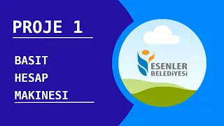

# English

### Project 1 - Simple Calculator

 

This project aims to build a simple calculator. Due to my intermediate web programming knowledge , I have also decided to add more complex Javascript codes. I explained some of the Javascript codes but our main concept is the algorithm of code and I have also explained it.

Deployed at https://sahinmaral-simplecalculator.netlify.app

<b>Click to picture to watch for understanding how to build </b>

<a href="https://www.youtube.com/watch?v=OlRJ2gqkEPk">
</img>
</a>

 
 
 

# Türkçe

### Proje 1 - Basit Hesap Makinesi

 

Bu projede amaç , basit bir hesap makinesi oluşturmaktır. Orta - ileri seviyede web programlama bilgim olduğundan biraz daha komplex Javascript kodu eklemeye de karar verdim. Javascript kodlarından bazılarını anlattım ama asıl amacımız kodun algoritması ve onu da anlattım.

https://sahinmaral-simplecalculator.netlify.app sitesine deploy edilmiştir

<b> Nasıl yapıldığını anlamak için resme tıklayıp izleyebilirsiniz </b>

<a href="https://www.youtube.com/watch?v=OlRJ2gqkEPk">
</img>
</a>

